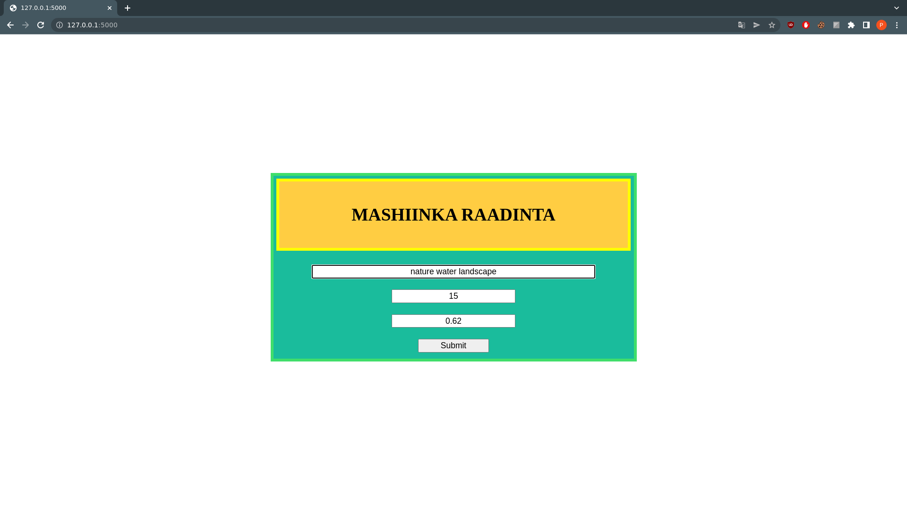
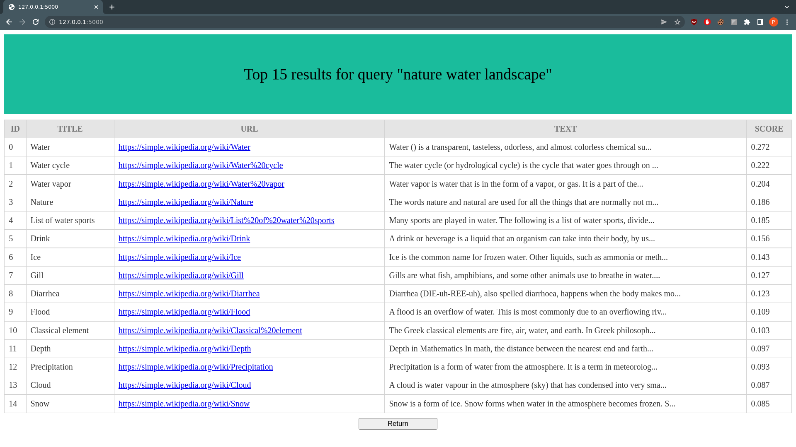

# Wyszukiwarka

## Instalacja
Należy zainstalować wymagania znajdujące się w pliku `requirements.txt`
```
pip install -r requirements.txt
```

## Uruchomienie
Program uruchamia się komendą
```
flask run
```
Po uruchomieniu powinien być dostępny pod adresem `http://127.0.0.1:5000/`.

## Modyfikacja zbioru danych
Zbiór danych można modyfikować nadpisując funkcję `init_entries` w pliku `BrowserApp/app/routes.py`, funkcja ta powinna zwracać `List[Entry]`.\
Przetworzone dane są cacheowane w folderze `BrowserApp/tmp/<nazwa_zbioru_danych>`.\
Metoda `fit` klasy `BrowserLogic` przyjmuje zmienną logiczną określającą czy chcemy wykorzystywać te dane czy wyliczać je na nowo.

## Logika programu
Część obliczeniowa programu znajduje się w ścieżce `BrowserApp/app/browser_logic`.

## Prezentacja


